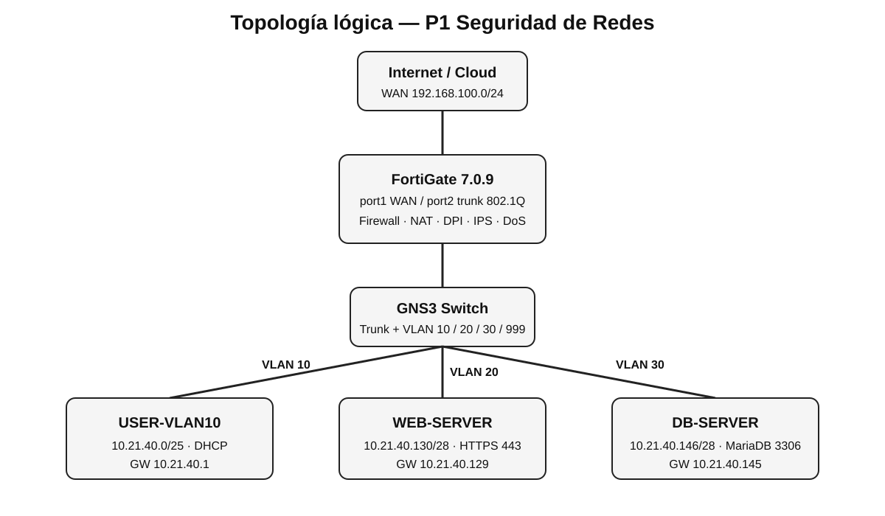

# Informe del Laboratorio de Seguridad de Redes — P1

**Estudiante:** REEMPLAZAR_NOMBRE  
**Matrícula:** 2025-2140  
**Plataforma:** GNS3  
**Firewall:** FortiGate 7.0.9  
**Servidores:** Ubuntu Server 24.04  

## 1. Propósito

El propósito de este laboratorio es diseñar, implementar y validar una infraestructura segmentada y protegida utilizando GNS3 y FortiGate. La solución separa usuarios, servidor web y servidor de base de datos mediante VLAN independientes y aplica controles de seguridad de red para restringir la comunicación entre segmentos.

Se implementaron ruta por defecto, NAT, DHCP, políticas de firewall, HTTPS, inspección profunda SSL (DPI), IPS con detección de SQL Injection, cuarentena automática del atacante, filtrado de archivos ejecutables, rate limiting y protección contra ataques de denegación de servicio.

## 2. Topología



La topología está compuesta por un FortiGate, un switch Ethernet de GNS3, un host de usuarios, un servidor WEB y un servidor de base de datos.

## 3. Direccionamiento

| Segmento | VLAN | Red | Gateway | Host |
|---|---:|---|---|---|
| USERS | 10 | 10.21.40.0/25 | 10.21.40.1 | DHCP 10.21.40.10-120 |
| WEB | 20 | 10.21.40.128/28 | 10.21.40.129 | 10.21.40.130 |
| DB | 30 | 10.21.40.144/28 | 10.21.40.145 | 10.21.40.146 |
| UNUSED | 999 | Sin L3 | - | Puertos no utilizados |
| WAN | - | 192.168.100.0/24 | 192.168.100.1 | FortiGate por DHCP |

## 4. Switch y VLAN

Configuración final:

- Port 0: VLAN 1, dot1q, hacia FortiGate port2.
- Port 1: VLAN 30, access, DB-SERVER.
- Port 2: VLAN 10, access, USER-VLAN10.
- Port 3: VLAN 20, access, WEB-SERVER.
- Puertos no utilizados: VLAN 999, access, sin gateway ni DHCP.

La VLAN 999 funciona como VLAN de aislamiento para puertos no utilizados.

## 5. FortiGate

### 5.1 Interfaces

- VLAN10-USERS: 10.21.40.1/25, DHCP habilitado.
- VLAN20-WEB: 10.21.40.129/28.
- VLAN30-DB: 10.21.40.145/28.
- WAN port1: red 192.168.100.0/24.

### 5.2 DHCP

Rango de usuarios: 10.21.40.10-10.21.40.120, máscara /25, gateway 10.21.40.1, DNS 8.8.8.8 y 1.1.1.1.

### 5.3 Ruta por defecto

- Destino: 0.0.0.0/0.
- Gateway: 192.168.100.1.
- Interfaz: Wan (port1).

Se verificó conectividad hacia 8.8.8.8 y resolución DNS hacia google.com.

### 5.4 NAT

La política USERS-TO-INTERNET permite salida desde VLAN10 hacia WAN con NAT habilitado usando la dirección de la interfaz de salida.

## 6. Políticas de seguridad

### Política 1 — USERS a WEB

- Incoming: VLAN10-USERS.
- Outgoing: VLAN20-WEB.
- Source: NET-USERS.
- Destination: WEB-SERVER.
- Service: HTTPS (TCP/443).
- Action: ACCEPT.
- NAT: OFF.
- Logging: All Sessions.

### Política 2 — USERS a DB

- Incoming: VLAN10-USERS.
- Outgoing: VLAN30-DB.
- Source: NET-USERS.
- Destination: DB-SERVER.
- Service: MYSQL (TCP/3306).
- Action: DENY.
- Logging: All.

### WEB a DB

- Incoming: VLAN20-WEB.
- Outgoing: VLAN30-DB.
- Source: WEB-SERVER.
- Destination: DB-SERVER.
- Service: MYSQL TCP/3306.
- Action: ACCEPT.
- NAT: OFF.

No existe otra regla WEB→DB, por lo que cualquier otro servicio queda sujeto al implicit deny.

## 7. DPI

Se utilizó el perfil `custom-deep-inspection` en modo **Protecting SSL Server**, asociado al certificado `WEB-SERVER-CERT`, para inspeccionar el tráfico HTTPS dirigido a 10.21.40.130.

## 8. SQL Injection, IPS y cuarentena

Sensor IPS: `IPS-SQLI-QUARANTINE`.

Firma: `HTTP.URI.SQL.Injection` (ID 15621).

Configuración:

- Action: Quarantine.
- Duración: 5 minutos.
- Packet Logging: Enabled.

Payload de laboratorio:

```bash
curl -k --connect-timeout 5 --max-time 15 "https://10.21.40.130/?id=1%27%20OR%20%271%27=%271--%20"
```

El FortiGate registró la firma HTTP.URI.SQL.Injection con origen 10.21.40.11 y acción dropped, además de aplicar cuarentena temporal al atacante.

## 9. Bloqueo de ejecutables

Perfil File Filter: `BLOCK-EXE`.

Regla:

- Protocol: HTTP/HTTPS inspeccionado.
- Traffic: Incoming.
- File Type: exe.
- Action: Block.
- Logging: Enabled.

Prueba:

```bash
curl -k -L --max-time 20 -o /tmp/test.exe https://10.21.40.130/test.exe
```

El log mostró `test.exe`, tipo `exe`, con acción `blocked`.

## 10. Rate limiting

Traffic Shaper: `LIMIT-WEB`.

- Type: Shared.
- Maximum Bandwidth: 2000 kbps.
- Priority: Medium.

Traffic Shaping Policy: `RATE-LIMIT-WEB`.

- Source Interface: VLAN10-USERS.
- Outgoing Interface: VLAN20-WEB.
- Source: NET-USERS.
- Destination: WEB-SERVER.
- Service: HTTPS.
- Shaper: LIMIT-WEB.

## 11. Protección DoS

DoS Policy: `PROTECT-WEB-DOS`.

- Incoming: VLAN10-USERS.
- Source: NET-USERS.
- Destination: WEB-SERVER.
- Service: HTTPS.

Anomalía:

- tcp_syn_flood.
- Logging: Enabled.
- Action: Block.
- Threshold: 100.

Prueba controlada:

```bash
timeout 3 sudo hping3 -S -p 443 -i u5000 10.21.40.130
```

El log Anomaly registró `tcp_syn_flood` para la IP 10.21.40.11.

## 12. WEB-SERVER

- IP: 10.21.40.130/28.
- Gateway: 10.21.40.129.
- Apache2.
- HTTPS TCP/443.
- Certificado autofirmado para el laboratorio.

Los archivos de Netplan, Apache y puertos están disponibles en `configs/web-server/`.

## 13. DB-SERVER

- IP: 10.21.40.146/28.
- Gateway: 10.21.40.145.
- MariaDB TCP/3306.
- bind-address: 10.21.40.146.
- Usuario de aplicación restringido al origen 10.21.40.130.

Los archivos relevantes están en `configs/db-server/`.

## 14. Pruebas de validación

| Requisito | Prueba | Resultado |
|---|---|---|
| VLAN10 + DHCP | ip a | Permitido / IP dinámica |
| Ruta por defecto | ping 8.8.8.8 | Correcto |
| DNS | ping google.com | Correcto |
| NAT | USER → Internet | Correcto |
| USERS → WEB 443 | curl -k https://10.21.40.130 | Permitido |
| USERS → DB 3306 | nc a DB:3306 | Bloqueado |
| WEB → DB 3306 | nc a DB:3306 | Permitido |
| WEB → DB otros servicios | 22/80/ICMP | Bloqueado |
| DPI | SSL Inspection | Activo |
| SQL Injection | Payload SQLi | Bloqueado |
| IPS Log | HTTP.URI.SQL.Injection | Registrado |
| Quarantine | IP atacante | Aplicada |
| .exe | test.exe | Bloqueado |
| Rate limit | Descarga archivo grande | Limitado a 2 Mbps |
| DoS | SYN flood | Detectado/Bloqueado |

## 15. Troubleshooting

Durante el montaje, el perfil `deep-inspection` estándar presentó problemas al combinarse con IPS en la VM FortiGate Evaluation. Se ajustó el perfil `custom-deep-inspection` a modo **Protecting SSL Server**, lo que permitió inspeccionar correctamente HTTPS y aplicar el sensor IPS.

También se utilizó consola únicamente para recuperar acceso administrativo cuando fue necesario; la configuración final y las evidencias fueron realizadas y verificadas desde la GUI.

## 16. Conclusión

El laboratorio implementa segmentación por VLAN, mínimo privilegio entre zonas, salida a Internet mediante NAT, servidor WEB HTTPS, base de datos restringida, inspección profunda, IPS, cuarentena, filtrado de ejecutables, rate limiting y mitigación de SYN flood. Las pruebas realizadas demuestran que las políticas permiten únicamente los flujos requeridos y bloquean los comportamientos no autorizados.
